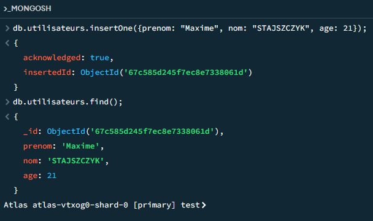

*Day 1 (03/03/2025)*

# MongoDB

## Sommaire :

- NoSQL 
- Pourquoi MongoDB ?
-
- Autres

### NoSQL

NoSQL ("Not Only SQL")

#### Caractéristiques Principales :

- Schéma absent ou flexible
- Scalabilité (façon à réagir aux nombres de requêtes entrantes) horizontale
- Opti pour des modèles de données spé
- Compromis dans la cohérence

#### Types de bases NoSQL (LGBD) :

Docs : MongoDB, CouchDB
Clé-Valeur : Redis, DynamoDB
Colonne : Cassandra, HBase
Graphe : Nej, OrientDb

#### Comparaison avec les bases relationnelles :

| Concept SQL  | Concept MongoDB          | Description |
| :--------------- |:---------------| :-----|
| Database  |   Database |  Contenue physique pour les collections |
| Table  | Collection | Groupe de documents MongoDB |
| Row  | Document |   Enregistrement unique dans une collection |
| Column | Field |   Paire clé-valeur dans un document |
| Index | Index | Améliore les performances des requêtes (Repère qui permet de facilité les recherches de lectures) |
| JOIN  | $lookup & Embedding |   Association entre documents |
| Primary Key | _id Fields | Identifiant unique pour chaque document |

*Pas de clés étrangères*

#### Différences fondamentales :

| Concept  | SQL | NoSQL |
| :--------------- |:---------------| :-----|
| Schéma  | Fixe | Flexible |
| Relation  | Fixe | Flexible |
| Schéma  | Fixe | Flexible |
| Schéma  | Fixe | Flexible |
| Schéma  | Fixe | Flexible |

### Pourquoi MongoDB ?

**Forces :**

- Schéma flexible adaptatif
- Modèle de données intuitif (JSON)
- Performances élevées en lecture/écriture
- Scalabilité horizontale (sharding natif)
- Requêtes riches & expressives
- Indexation avancée
- Distribution géographique
- Support de transactions multi-documents

**Cas d'usages :**

- Application web & mobiles
- Gestions de contenus (CMS)
- E-commerce (catalogues produits)
- IoT & données en temps réel
- Big Data & analytique
- Gestion de métadonnées
- Stockage de données de configuration
- Caching & sessions

MongoDB est plus puissant et plus performant
MongoDB est utilisé de partout

#### Structure 

#### Structure Physique

### Format BSON

BSON (Binary JSON) est le format de stockage & d'échange de données utilisé par MongoDB.

**Caractéristiques :**

- Extension binaire de JSONN
-
-
-
-

**Types de données BSON :**

- Types de base : String, Number, Boolean, Null
- Types étendus :
    - ObjectId (Id unique sur 12 octets)
    - Date
    - BinData
    - RegEXP
    - TimeStamp (horodatage interne)
    - NumberDecimal, NumberLong, NumberInt

*Exemple :*

### Options d'installation

**MongoDB Atlas (Cloud)**

1. Création d'un compte sur mangodb.com/atlas
2. Déploiement d'un cluster gratuit (M0)
3. Configuration du réseau (liste blanche IP)
4. Création d'un utilisateur pour la connexion
5. Obtention de la chaîne de connexion

**Installation locale :**

*Windows :*

- Téléchragement de l'installateur MSI
- Assistant d'installation
- Option "MongoDB ..."

#### Interfaces MongoDB

**MongoDB Shell (mongosh) :**

Interface ligne de commande interactive avec syntaxe JavaScript

**MongoDB Compass :**

#### Create : Insertion de document

**Options importantes :**

- ordered : contrôle si les insertions doivent s'arrêter après une erreur (default : true)
- writeConcern : niveau d'accusé de réception pour l'opération d'écriture

#### Read : Lecture de documents

- find()
- findOne()

**Méthodes de comptage**

#### Update : Mise à jour

- update()
- updateMany()

****

**Options de mise à jour**

- upsert (insert + update) : Insertion si n'existe pas (default : false)
- multi màj tout les fichiers

#### Opérateurs de mise à jour :

**Opérateurs de champs :**

**Opérateurs de tableaux**

#### Delete : Suppression de documents

- deleteOne()
- deleteMany()
- drop()

#### Opérateurs Logiques

- and (ET logique)
- $not (NON Logique)
- $or (OU logique)
- $nore (NI...NI logique)

**Combinaisons complexes**

#### Where there is $size

### Requêtes sur les documents imbriqués

### Projection et limitation des résultats

### Test

**1ère Requête :**

### Modélisation de données dans MongoDB

#### Documents embarqués (dénormalisation)

#### Références (équivalent à clés étrangères)

#### Facteurs de décision

- Fréquence d'accès aux données liées ensemble
- Volume & croissance des données liées
-
-
-

### Indexation dans MongoDB

#### Pourquoi indexer vos données

**Sans index :**

- MongoDB parcourt chaque Document (COLLSCAN)
- Performances linéaires : O(n)
- Problématique sur les lgrandes collections
- Consomme beaucoup de ressources
- Temps de réponse très lent

**Avec index :**

- Améliore drastiquement les requêtes
- Structure de données efficace (B-tree)
- Algorithme de recherche optimisé
- Performances logarithmiques : O(log n)
- Nécessaire pour les applications en production

### Autres

Modification de schémas SQL = Alter (Risque de perte de données)

BDD existe si Collection existe si au moins 1 Document existe

✖️ insert ✔️ insertOne/insertMany

kaggle.com/learn