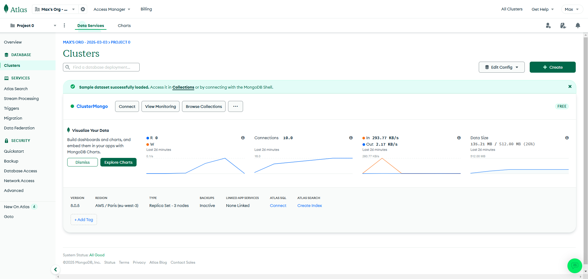
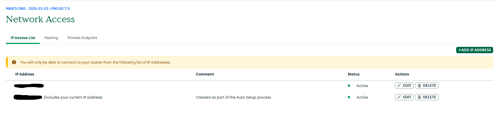
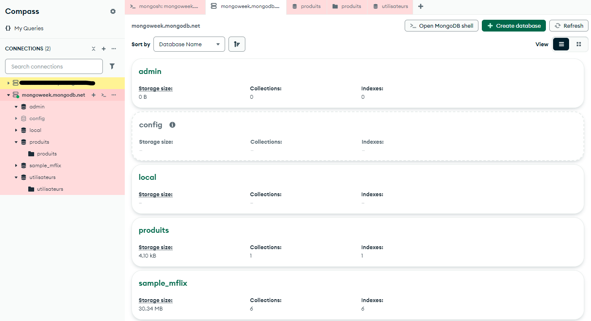
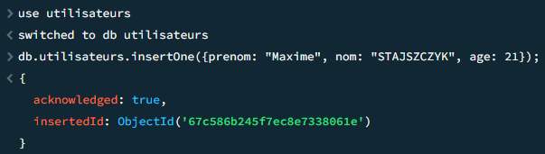
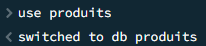
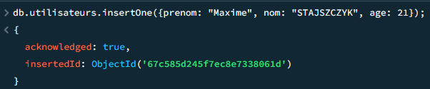
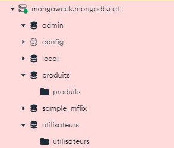

# TP 1

### Objectif

*Mettre en place un environnement MongoDB
fonctionnel et se familiariser avec l’interface.*

## 1. Création d’un compte MongoDB Atlas

## 2. Configuration des accès

## 3. Connexion avec MongoDB Compass

## 4. Création de vos premières collections

## 5. Importation de données initiales

## 6. Première exploration

