# TP 2

### Exercice 1 : Création d'un jeu de données :

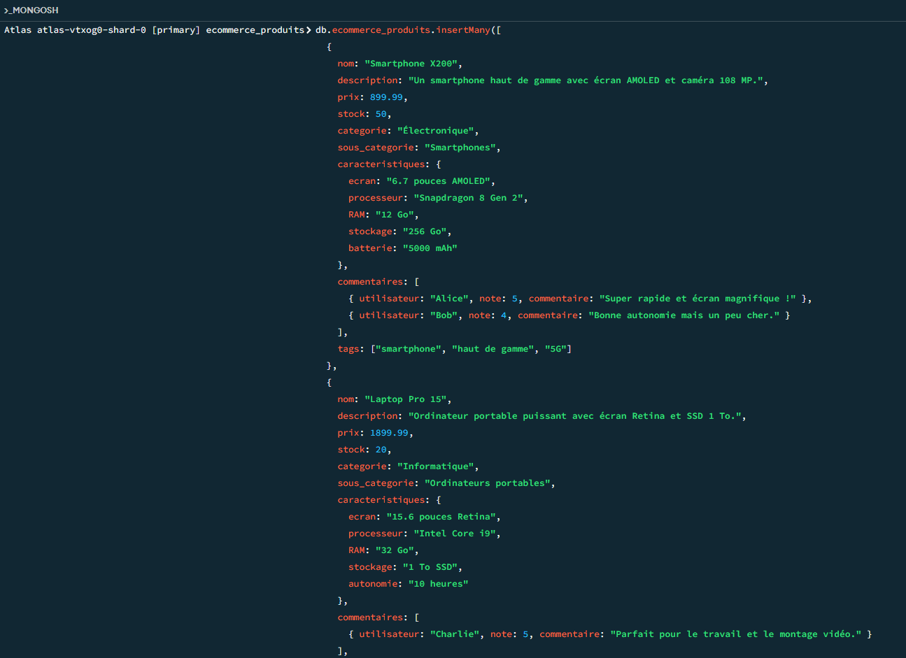

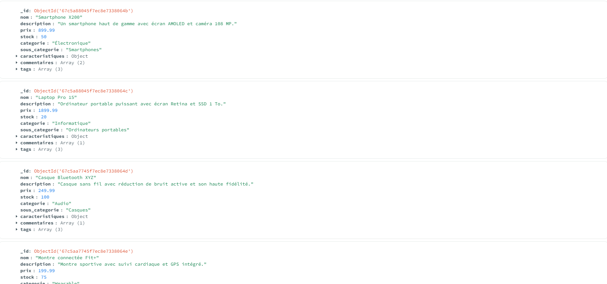

### Exercice 2 : Requêtes de lecture

**1. Récupérer tous les produits d'une catégories**

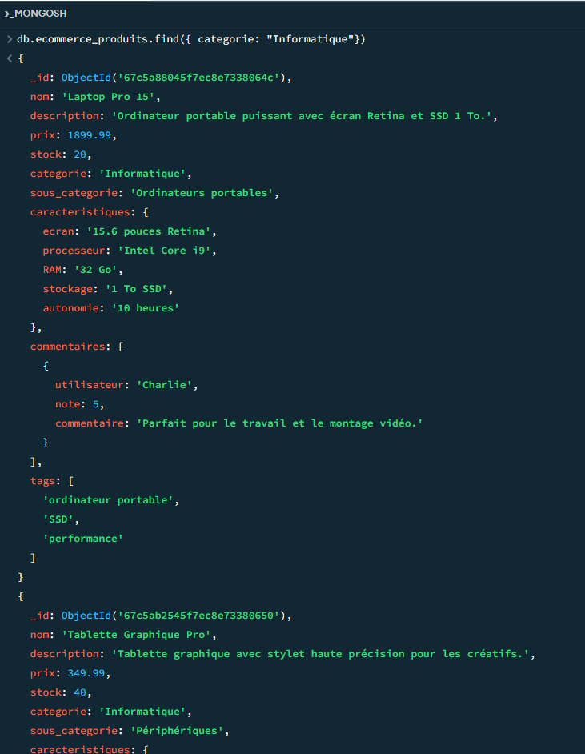

**2. Trouver les produits dont le prix est entre 50 et 200€**

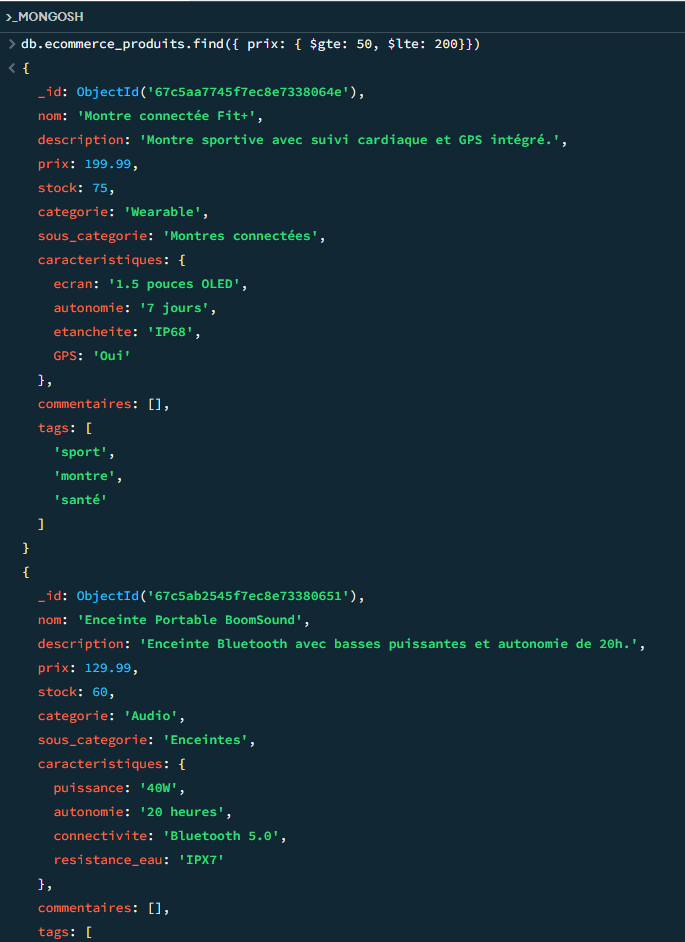

**3. Lister les produits en stock (stock > 0)**

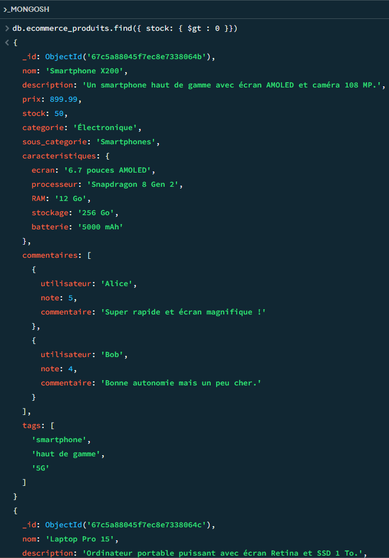

**4. Trouver les produits avec au moins 3 avis**

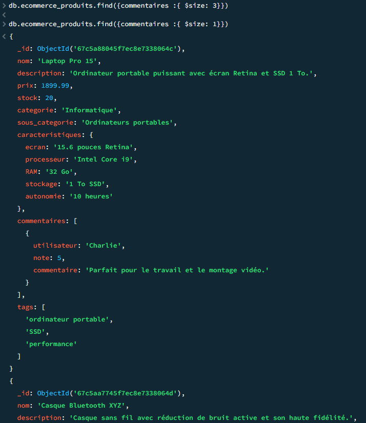

### Exercice 3 : Mises à jour

**1. Augmenter le prix de tous les produits d'une catégories de 5%**

V

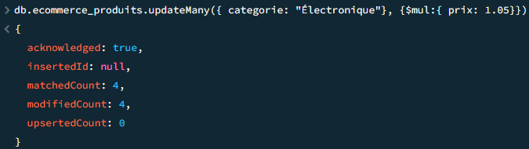

V

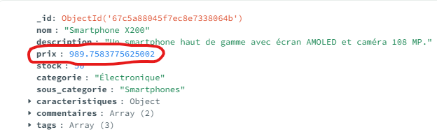

**2. Ajouter un champ "promotion" à certains produits**

  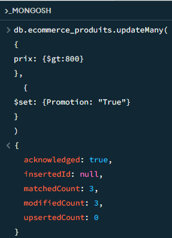

V

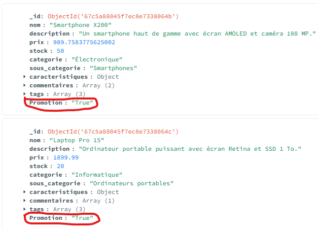

**3. Ajouter un nouveau tag à tous les produits d'une catégorie**

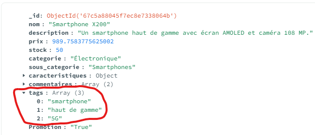

V

  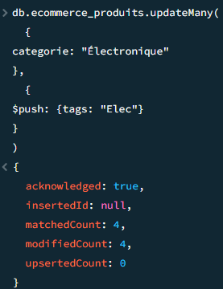

V

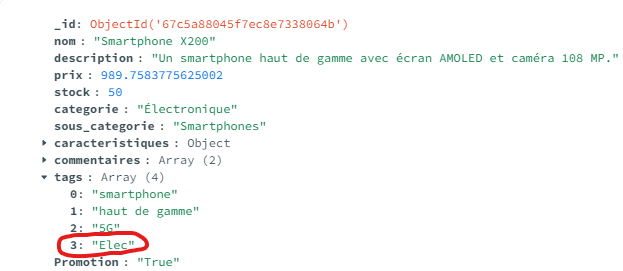

**4. Mettre à jour le stock après une "vente"**

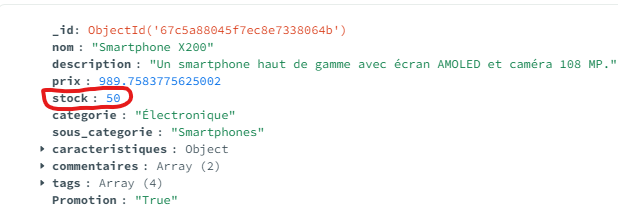

V

  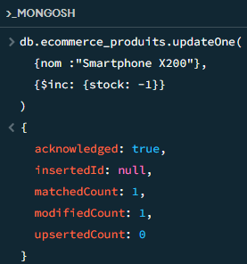

V

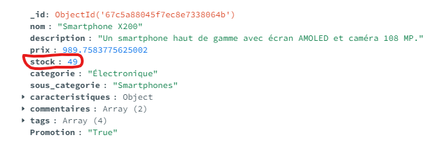

### Exercice 4 : Requêtes complexes

**1. Trouver les produits disponibles avec tag1 ET tag2**

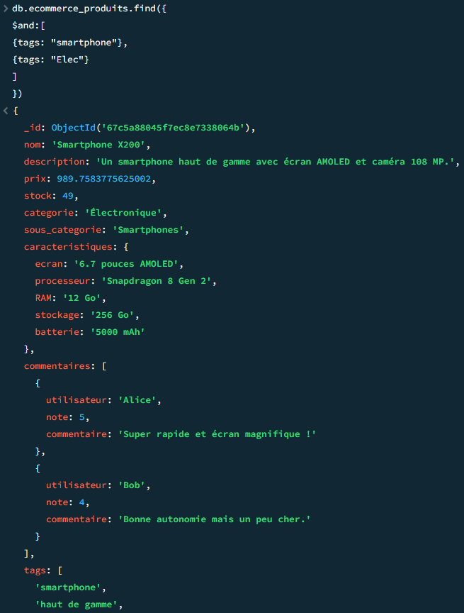

**2. Lister les produits premium avec un stock faible (<5)**

- *Ajout du champ Premium*

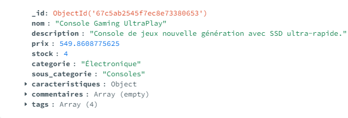

V

  

V

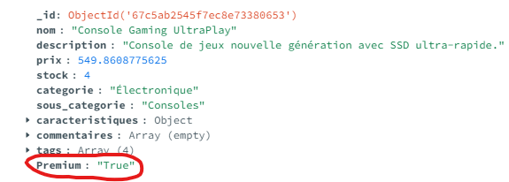

- *Recherche*

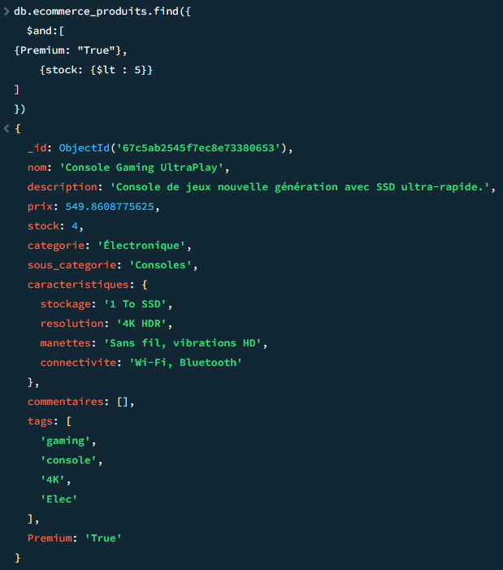

**3. Rechercher les produits ayant reçu au moins un avis 5 étoiles**

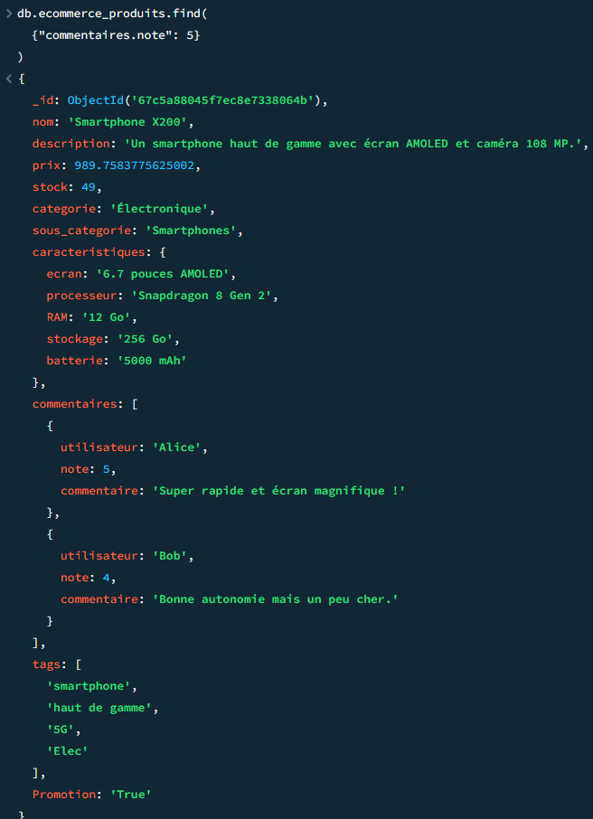

**4. Trouver les produits d'une catégorie, triés par prix décroissant, limités aux 5 premiers**

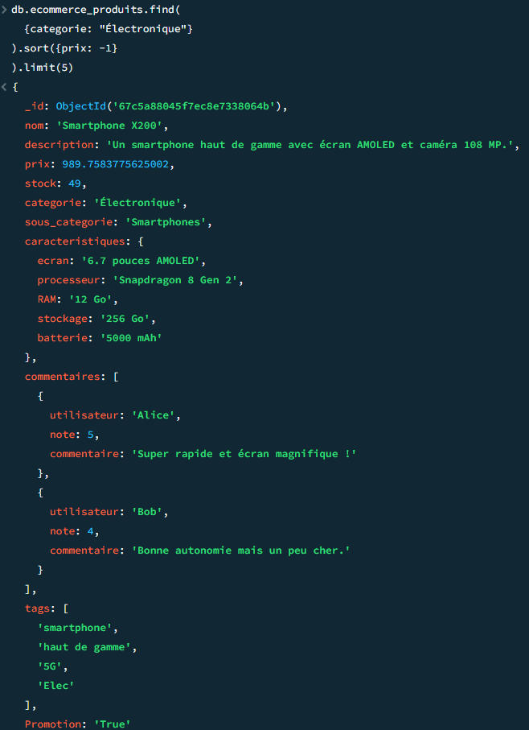

**Document de réflexion sur la modélisation des données choisie**

La modélisation des données choisie permet d'avoir un schéma flexible adaptatif et un modèle de données intuitif (JSON)

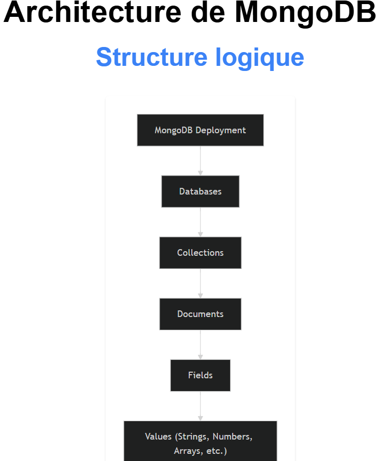