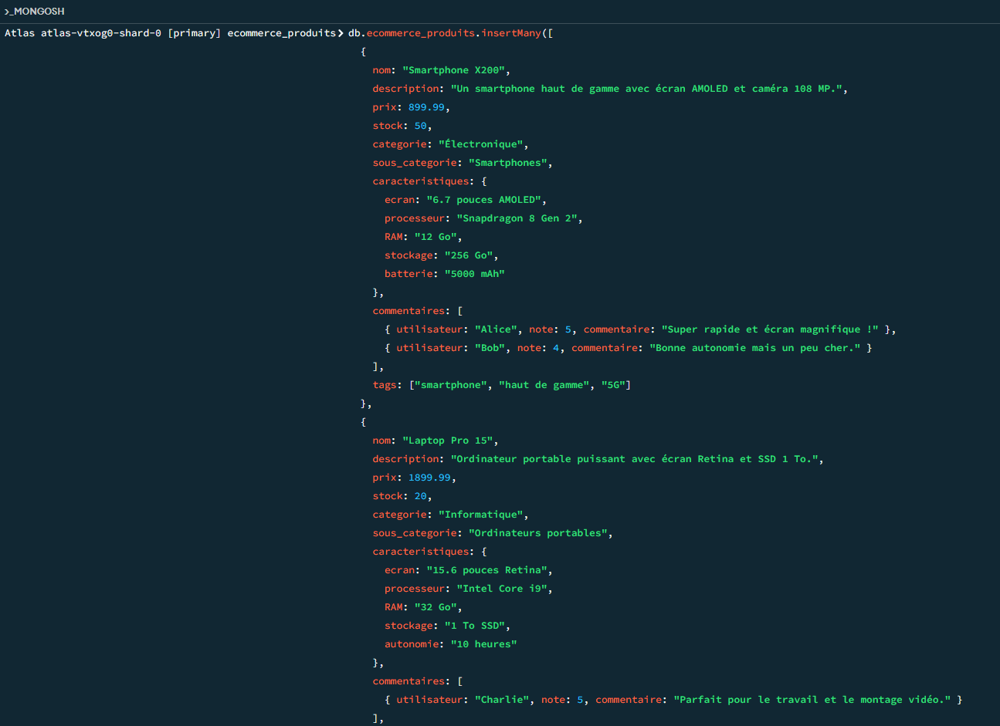
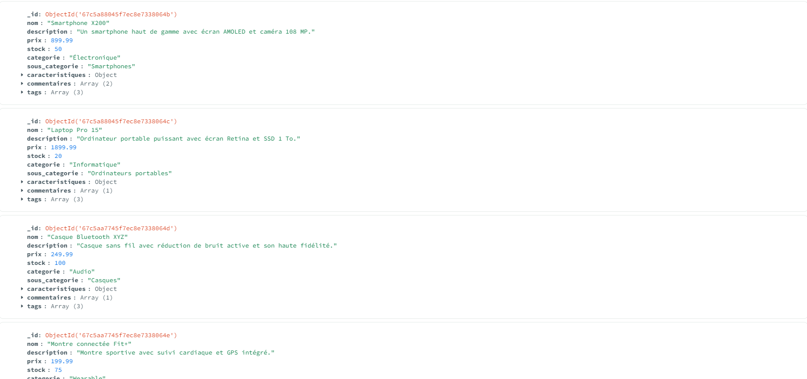
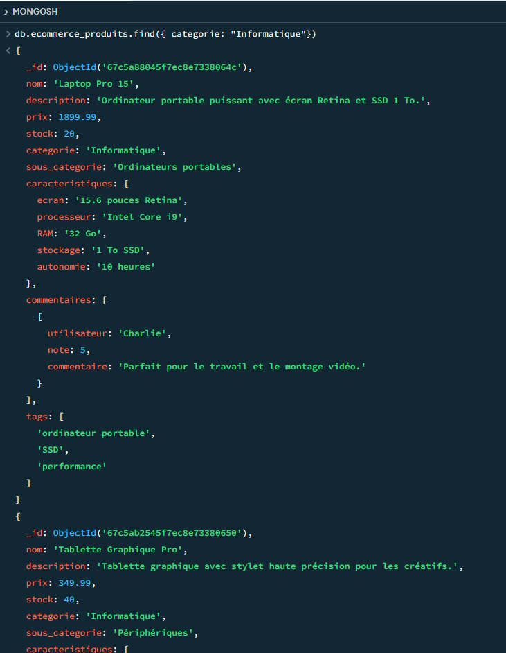
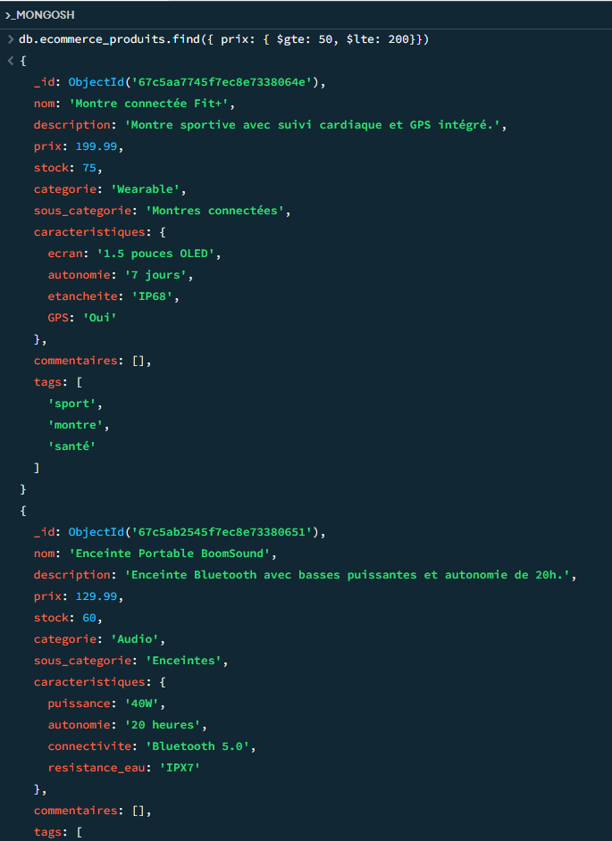
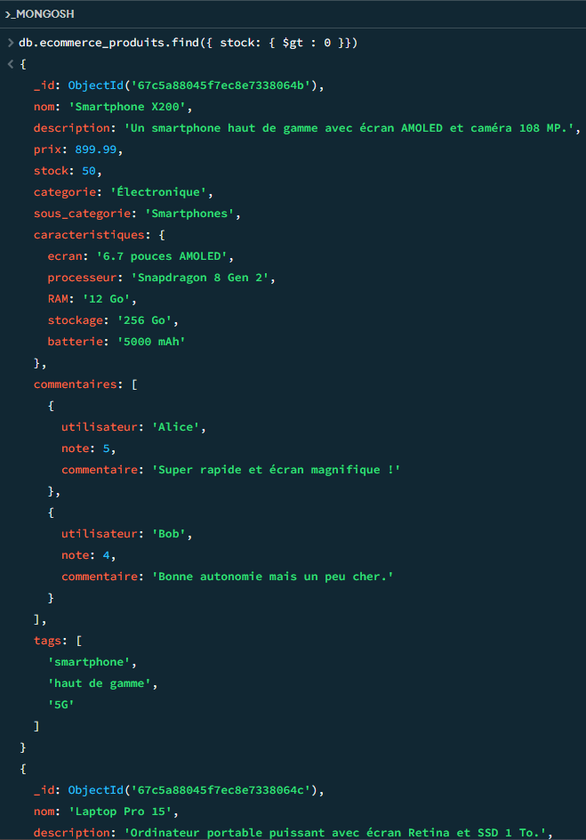
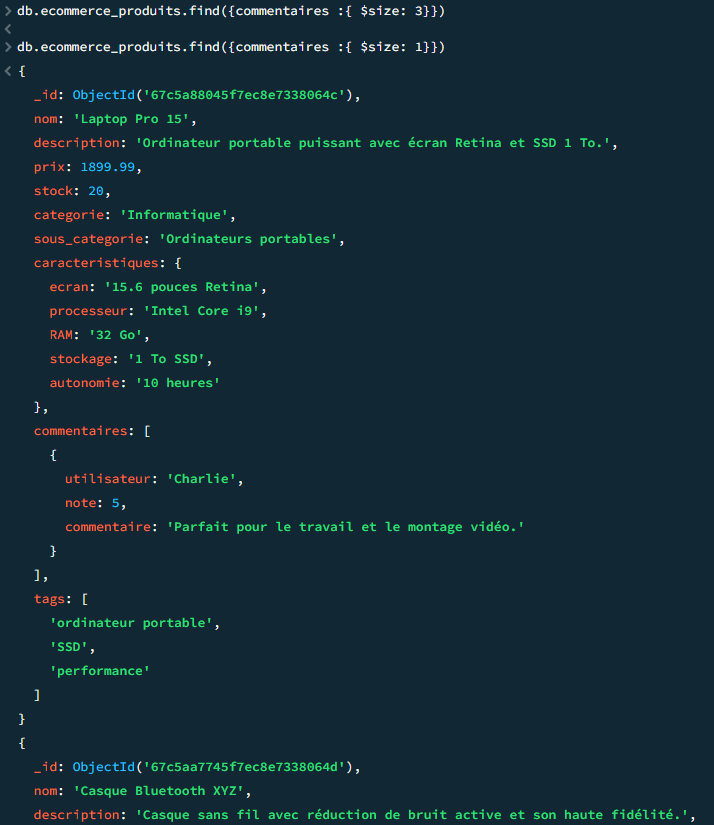
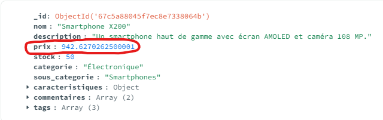
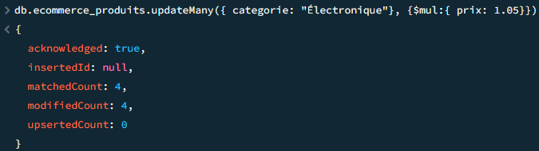
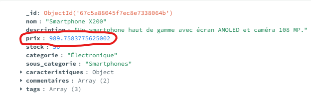

# TP 2

### Exercice 1 : Création d'un jeu de données :

### Exercice 2 : Requêtes de lecture

**1. Récupérer tous les produits d'une catégories**

**2. Trouver les produits dont le prix est entre 50 et 200€**

**3. Lister les produits en stock (stock > 0)**

**4. Trouver les produits avec au moins 3 avis**

### Exercice 3 : Mises à jour

**1. Augmenter le prix de tous les produits d'une catégories de 5%**

V

V

**2. Ajouter un champ "promotion" à certains produits**

