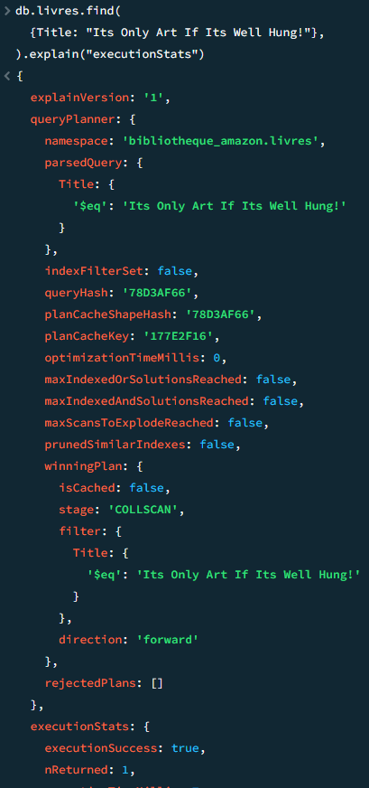
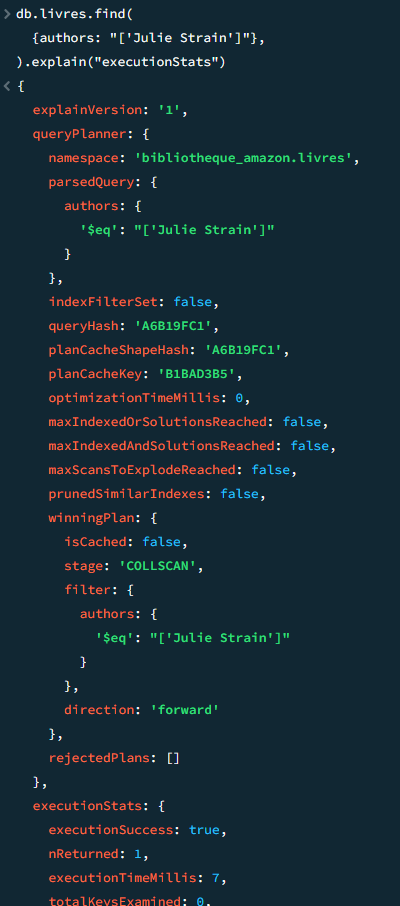
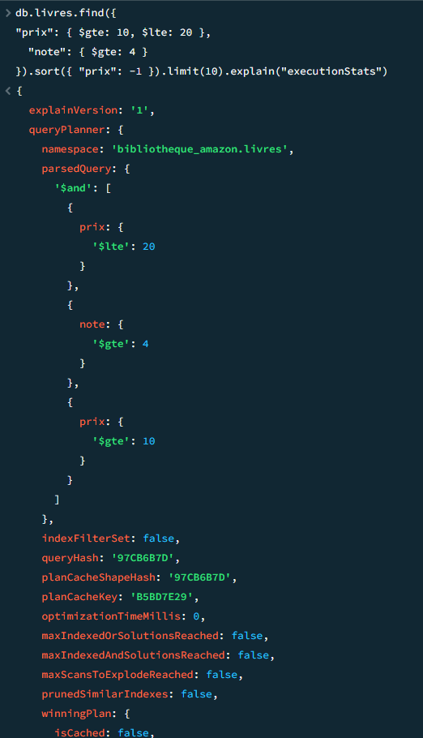

# TP MONGODB - INDEXATION, GÉOSPATIAL ET AGRÉGATION

### Partie 1 : Indexation et optimisation des performances

#### Exercice 1.1 : Préparation et analyse des performances sans index

**2. Analysez les performances des requêtes suivantes sans index en utilisant explain("executionStats") :**

*Une recherche par titre exact*

*Une recherche par auteur*

*Une recherche par plage de prix (ex: entre 10€ et 20€) et note minimale*

*Une recherche filtrée par genre et langue avec tri par note décroissante*

#### Exercice 1.2 : Création d'index simples et composites
