# TP Final

### Partie 1 : Configuration et création de la base de données

<del>db.createcollection("Books_list")

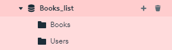

  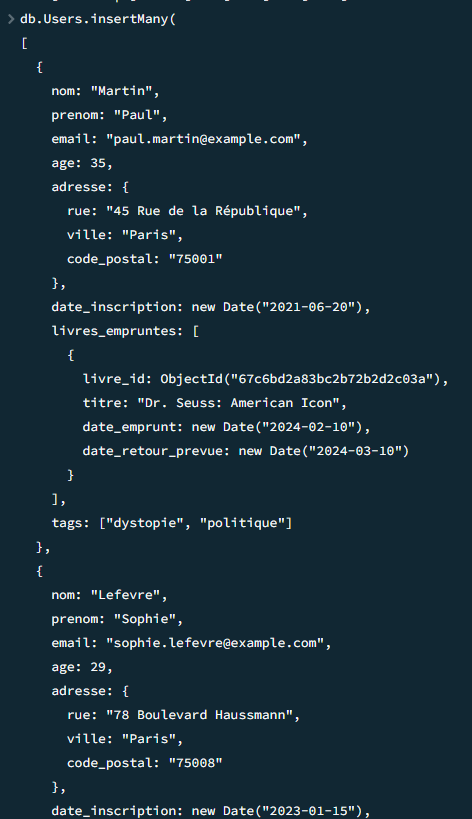

V

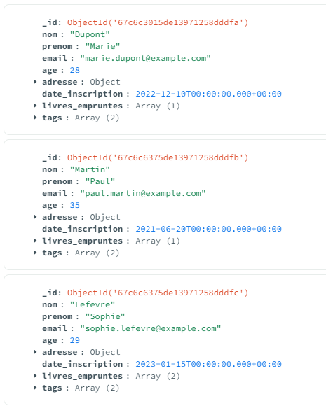

### Partie 2 : Requêtes de lecture (Read)

**1. Listez tous les livres disponibles (si vous utilisez le dataset Amazon, ajoutez d'abord un champ disponible à vos documents)**

*Ajout du champ disponible*

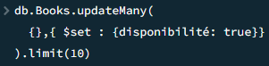

<del>.limit inutile

*Recherche*

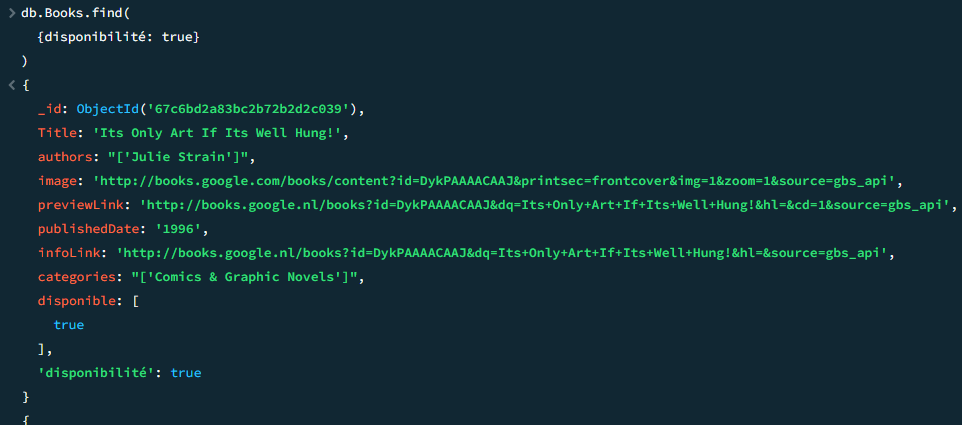

**2. Trouvez les livres publiés après l'an 2000**

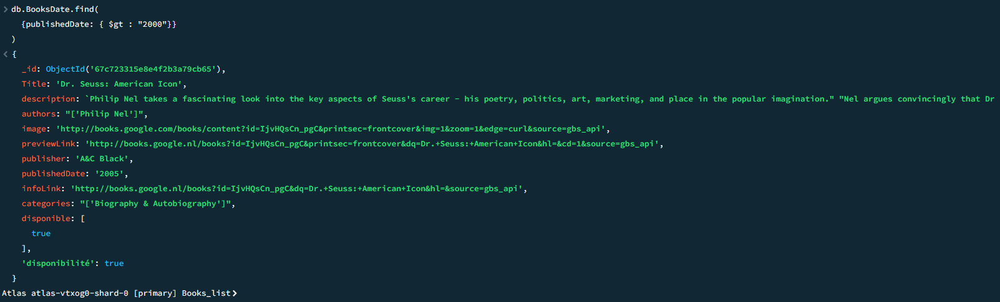

**3. Trouvez les livres d'un auteur spécifique**

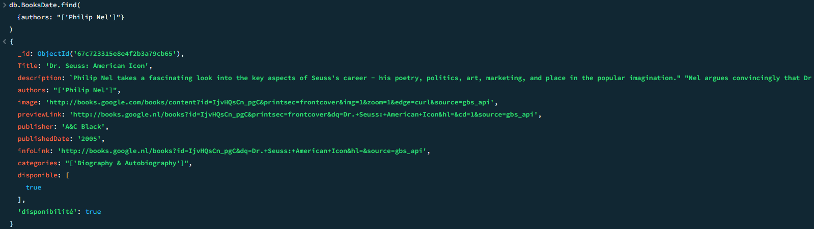

**4. Trouvez les livres qui ont une note moyenne supérieure à 4**

*Ajout des notes*

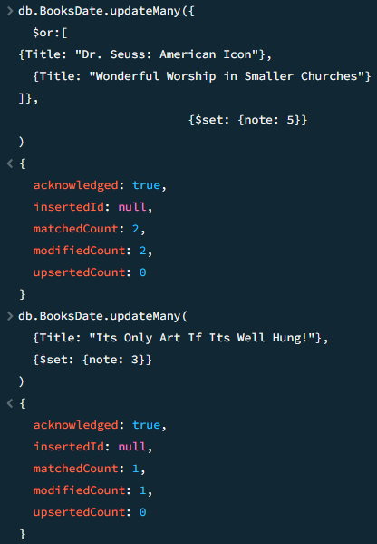

*Recherche*

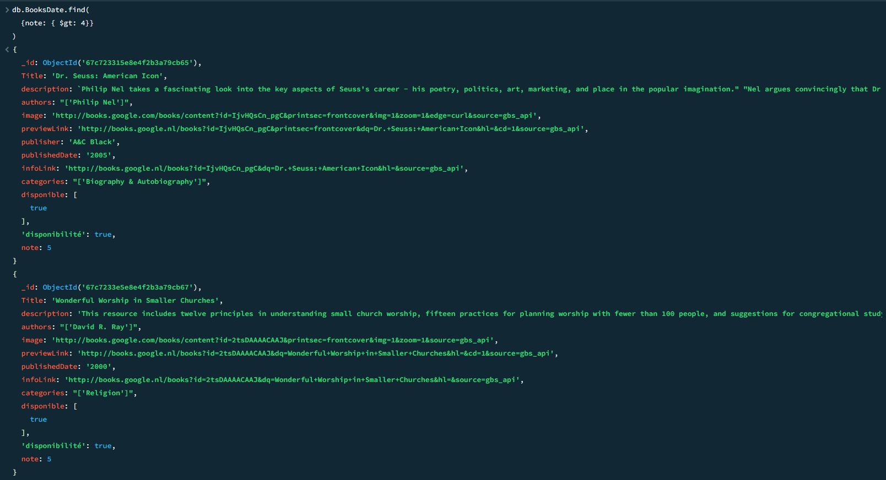

**5. Listez tous les utilisateurs habitant dans une ville spécifique**

*Ajout des lieux d'habitations*

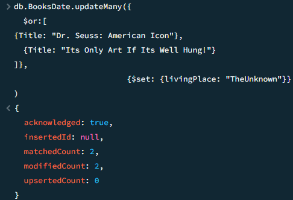

*Recherche*

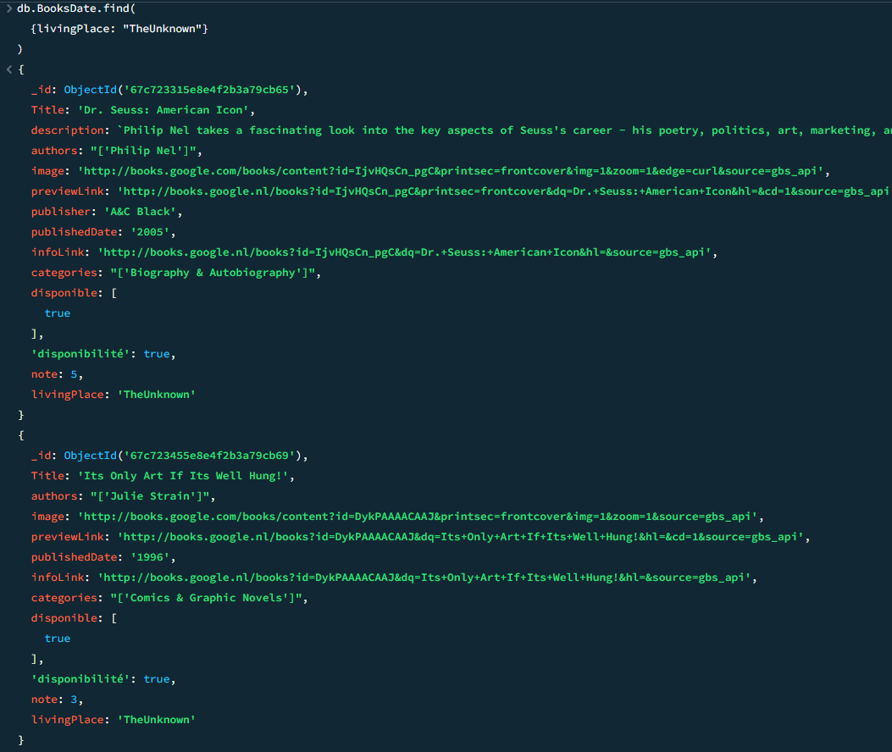

**6. Trouvez les livres qui appartiennent à un genre spécifique**

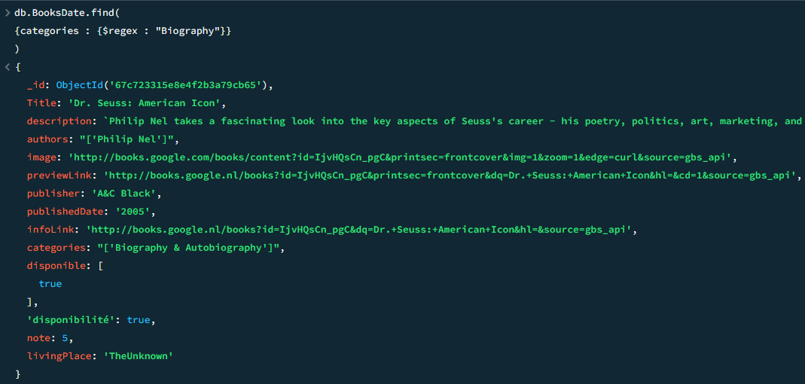

*$regex permet de récupérer les livres qui contiennent la chaine "Biography" dans leur catégorie*

**7. Trouvez les livres qui ont à la fois un prix inférieur à 15€ et une note moyenne supérieure à 4**

*Ajout des prix*

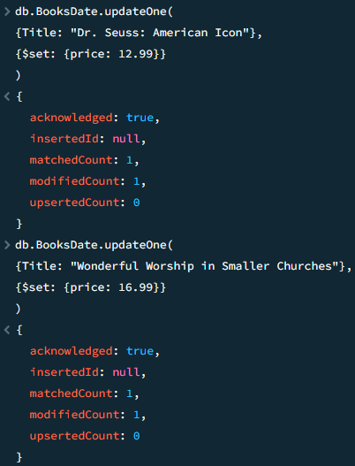

*Recherche*

**8. Trouvez les utilisateurs qui ont emprunté un livre spécifique (par titre)**