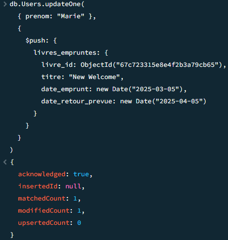
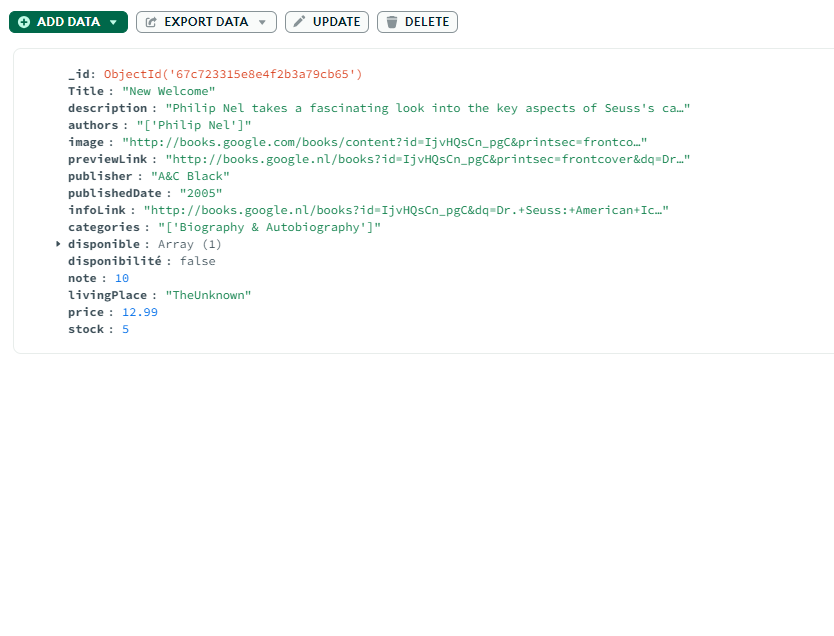

# TP Final

### Partie 1 : Configuration et création de la base de données

<del>db.createcollection("Books_list")

  

V

### Partie 2 : Requêtes de lecture (Read)

**1. Listez tous les livres disponibles (si vous utilisez le dataset Amazon, ajoutez d'abord un champ disponible à vos documents)**

*Ajout du champ disponible*

<del>.limit inutile

*Recherche*

**2. Trouvez les livres publiés après l'an 2000**

**3. Trouvez les livres d'un auteur spécifique**

**4. Trouvez les livres qui ont une note moyenne supérieure à 4**

*Ajout des notes*

*Recherche*

**5. Listez tous les utilisateurs habitant dans une ville spécifique**

*Ajout des lieux d'habitations*

*Recherche*

**6. Trouvez les livres qui appartiennent à un genre spécifique**

*$regex permet de récupérer les livres qui contiennent la chaine "Biography" dans leur catégorie*

**7. Trouvez les livres qui ont à la fois un prix inférieur à 15€ et une note moyenne supérieure à 4**

*Ajout des prix*

*Recherche*

**8. Trouvez les utilisateurs qui ont emprunté un livre spécifique (par titre)**

### Partie 3 : Mise à jour de documents (Update)

**1. Mettez à jour le titre d'un livre spécifique**

V

  

V

**2. Ajoutez un champ stock à tous les livres avec une valeur par défaut de 5**

  

V

**3. Marquez un livre comme indisponible (disponible = false)**

  

V

**4. Ajoutez un nouvel emprunt dans la liste livres_empruntes d'un utilisateur**

  

V

**5. Changez l'adresse d'un utilisateur**

V

  

V

**6. Ajoutez un nouveau tag à un utilisateur**

V

  

V

**7. Mettez à jour la note moyenne d'un livre**

V

  

V

### Partie 4 : Suppression de documents (Delete)

**1. Supprimez un livre spécifique par son titre**

V

  

V

**2. Supprimez tous les livres d'un auteur spécifique**

V

  

V

**3. Supprimez un utilisateur par son email**

V

  

V

### Partie 5 : Requêtes avancées et projection

**1. Listez tous les livres triés par note moyenne (ordre décroissant)**

**2. Trouvez les 3 livres les plus anciens**

*20?? étant considéré comme 20, la requête ressort 3 livres ayant cette date de publication renseignée*

**3. Comptez le nombre de livres par auteur**

**4. Affichez uniquement le titre, l'auteur et la note moyenne des livres (sans l'id)**

**5. Trouvez les utilisateurs qui ont emprunté plus d'un livre**

**6. Recherchez les livres dont le titre contient un mot spécifique (utilisez $regex)**

*$option: "i" permet de ne pas prendre la casse en compte*

**7. Trouvez les livres dont le prix est entre 10€ et 20€**

